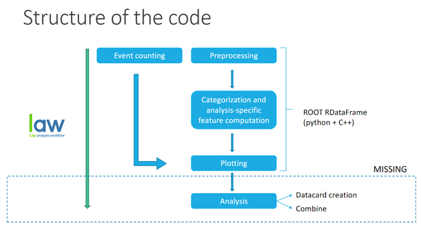

.. _structure:

====================================
Structure of the framework
====================================

This framework is structured in two separate repositories, summarized in the next sections.

User code
---------

This repository should contain the user's configuration and custom tasks. As an example, `this repository  <https://github.com/jaimeleonh/hhbbtt-analysis>`_
includes the code used for the HH->bbtt analysis, and it can be used as an example to add the desired configuration.

It contains two folders:

- *Config*: it contains different files in yaml and python format to define the configuration of the analysis.
- *Tasks*: files in python format. Custom tasks (i.e. specific from your analysis or modifying a common task) can be stored here taking advantage of inheritance. 

`Main code <https://gitlab.cern.ch/cms-phys-ciemat/nanoaod_base_analysis/>`_
-----------------------------------------------------------------------------
Base code of the framework that shouldn't be modified unless there is any improvement suggestion. In this repository there are several folders, some of them just to document information about the code, and inside the main one (*/cmt/*) are a few relevant files on our understanding of the code:

- `preprocessing.py <https://gitlab.cern.ch/cms-phys-ciemat/nanoaod_base_analysis/-/blob/py3/cmt/base_tasks/preprocessing.py>`_: main tasks of the code to process data and to count events are defined here.

- `plotting.py <https://gitlab.cern.ch/cms-phys-ciemat/nanoaod_base_analysis/-/blob/py3/cmt/base_tasks/plotting.py>`_: definitions of the tasks used to make plots of the processed data.

- `base_config.py <https://gitlab.cern.ch/cms-phys-ciemat/nanoaod_base_analysis/-/blob/py3/cmt/config/base_config.py>`_: useful datasets and definitions of the mandatory variables for the analysis.

All this code gives us the opportunity to execute multiple tasks depending on what we want to do, and can be summarized with this diagram:

Where there are two branches of tasks before plotting depending on what the goal is: event counting or processing data.
In the section :ref:`tasks` you can see step by step how it works and which are the specific tasks the code can make.
