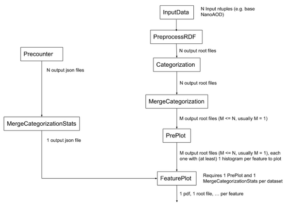
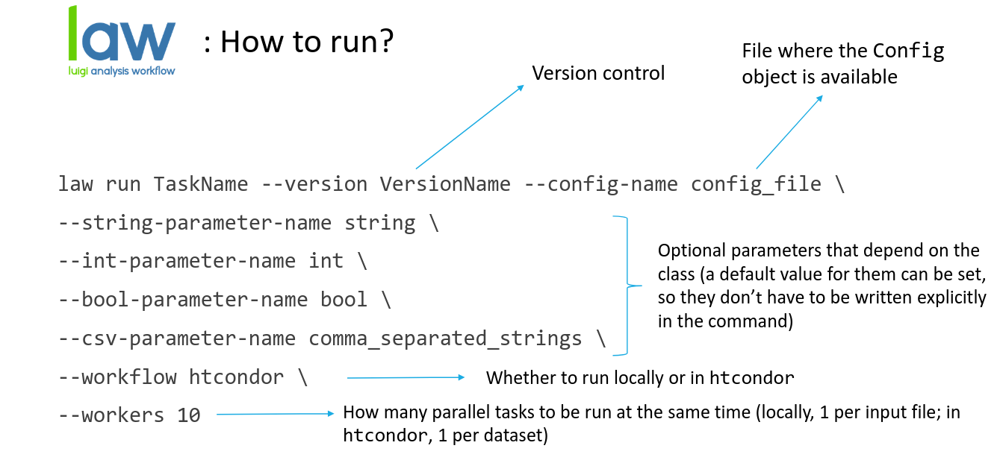

.. _tasks:

=================
Executing tasks
=================

NanoAOD-base-analysis execution is divided into different steps, which corresponds to different tasks, represented in the following diagram:

Where the N input ntuples refers to N branches of a dataset, so every output root file is the output file for every branch, excepting for the *Merge* tasks, which merge several files into one. Output files of every task can be found inside the *$CMT_STORE* directory.

In the diagram we can see there are two tasks branches before plotting, which we will perform separately: event counting (to apply proper weights) and the actual processing of the data/MC input files. Let's see a description of every task:

- **Event counting**:
 
  1. **PreCounter**: Performs a counting of the events with and without applying the necessary weights. Weights are read from the configuration file. In case they have to be computed, RDF modules can be run. It returns one .json file per input file.

  2. **MergeCategorizationStats**: Merges the output from the *PreCounter* task into one .json file in order to reduce the parallelization entering the plotting tasks.

- **Processing of the data/MC**: 

  1. **PreprocessRDF**: Performs the preprocessing step applying a preselection and running RDF modules. Input is N ntuples files, and output is N root files.

  2. **Categorization**: Performs the categorization step running RDF modules and applying a post-selection (signal categories, control...). Same behaviour as preprocessing but aimed for each analysis to run its analysis-specific features. It will look for the output of a *PreprocessRDF* run, and if that output doesn't exist (because you didn't run *PreprocessRDF*, for example), it will perform the *PreprocessRDF* as well. This task is not necessary to perform the netx step.

  3. **MergeCategorization**: Merges the output from the *Categorization* or *PreprocessRDF* tasks (with the ``--from_preprocess`` parameter) in order to reduce the parallelization entering the plotting tasks. By default it merges into one output file, although a different number can be set with the merging parameter inside the dataset definition.

  4. **PrePlot**: Performs the filling of histograms in parallel for all features considered. If systematics are considered, it also produces the same histograms after applying those.

- **FeaturePlot**: Performs the actual histogram plotting: loads the histograms obtained in *PrePlot* task, rescales them if needed, plots and saves them. Output are .pdf files. For this task to be run both *MergeCategorizationStats* and *PrePlot* outputs are required.
 

 
The general structure of the bash commands to run each law task is:

When running each task, there are multiple parameters that can be added to do your analysis in some specific ways. For example, there's the possibility to use just one specific branch from your dataset with the parameter ``--branch`` (which starts in 0) or all of them (by default). 

To run all tasks over several datasets in parallel, except for *PrePlot* and *FeaturePlot*, is also possible. This can be done by just adding *Wrapper* at the end of the task command name (e.g. ``law run PreCounterWrapper``).

For a better understanding on how to perform a NanoAOD-base-analysis let's take as an example an analysis for all branches of the gluon-gluon fusion standard model dataset (which is inside the main code) with no systematics, using as parameters *ul_2018* configuration and *modulesRDF* files, *base_selection* and *etau* categories and running all jobs locally. Finally we'll obtain some plots for the *Htt_svfit_mass*, *Htt_svfit_pt*, *Htt_svfit_eta* features.

.. code-block:: console

  law run PreCounter --version test_ggf --config-name ul_2018 --dataset-name ggf_sm --weights-file weights --workflow local --workers 10

  law run MergeCategorizationStats --version test_ggf --config-name ul_2018 --dataset-name ggf_sm --workflow local --workers 10

  law run PreprocessRDF --version cecilia_testnfs --category-name base_selection --config-name  ul_2018 --dataset-name ggf_sm --workflow local --workers 10 --modules-file modulesrdf --max-runtime 48h

  law run Categorization --version test_ggf --category-name etau --config-name  ul_2018 --dataset-name ggf_sm --workflow local --base-category-name base_selection --workers 10

  law run MergeCategorization --version test_ggf --category-name etau --config-name  ul_2018 --dataset-name ggf_sm --workflow local --Categorization-base-category-name base_selection --workers 10

  law run PrePlot --version test_ggf --category-name etau --config-name ul_2018 --feature-names Htt_svfit_mass,Htt_svfit_pt,Htt_svfit_eta --dataset-name ggf_sm --PrePlot-workflow local --workers 10 --MergeCategorization-version test_ggf --MergeCategorizationStats-version test_ggf

  law run FeaturePlot --version test_ggf --category-name etau --config-name ul_2018 --process-group-name signal --feature-names Htt_svfit_mass,Htt_svfit_pt,Htt_svfit_eta --region-name etau_os_iso --stack --dataset-name ggf_sm --PrePlot-workflow local --workers 10 --MergeCategorization-version test_ggf --MergeCategorizationStats-version test_ggf --apply-weights False

This is just an example on how to run a NanoAOD-base-analysis, but more specific information on how to run each task can be found in the :ref:`api`, where more examples can be found as well. Also the available options for each task execution command can be checked with the ``--help`` option. 
